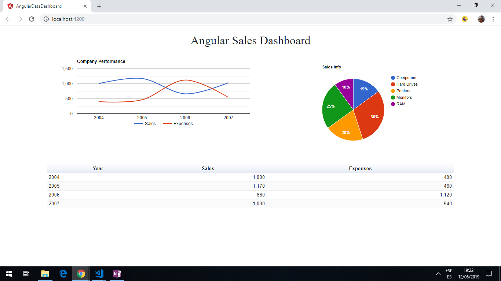

# :zap: Angular Data Dashboard

* Angular 9 app using [Google Charts](https://developers.google.com/chart/) to create a dashboard with a [line-chart](https://developers.google.com/chart/interactive/docs/gallery/linechart), [pie-chart](https://developers.google.com/chart/interactive/docs/gallery/piechart) and [table-chart](https://developers.google.com/chart/interactive/docs/gallery/table).

*** Note: to open web links in a new window use: _ctrl+click on link_**

## :page_facing_up: Table of contents

* [:zap: Angular Data Dashboard](#zap-angular-data-dashboard)
  * [:page_facing_up: Table of contents](#pagefacingup-table-of-contents)
  * [:books: General info](#books-general-info)
  * [:camera: Screenshots](#camera-screenshots)
  * [:signal_strength: Technologies](#signalstrength-technologies)
  * [:floppy_disk: Setup](#floppydisk-setup)
  * [:computer: Code Examples](#computer-code-examples)
  * [:cool: Features](#cool-features)
  * [:clipboard: Status & To-Do List](#clipboard-status--to-do-list)
  * [:clap: Inspiration](#clap-inspiration)
  * [:envelope: Contact](#envelope-contact)

## :books: General info

Google chart tools have a wide range of interactive charts and data tools.

## :camera: Screenshots



## :signal_strength: Technologies

* [Angular framework v9](https://angular.io/)
* [Google Charts](https://developers.google.com/chart/) based on pure html/svg.
* [Bootstrap v4](https://getbootstrap.com/)

## :floppy_disk: Setup

* Run `npm i` to install dependencies.
* Run `ng serve` for a dev server. Navigate to `http://localhost:4200/`. The app will automatically reload if you change any of the source files.
* Run `ng build` to build the project. The build artifacts will be stored in the `dist/` directory. Use the `--prod` flag for a production build.
* Run `ng e2e` to execute the end-to-end tests via [Protractor](http://www.protractortest.org/).

## :computer: Code Examples

```typescript
// method using the Google Charts library with the gLib variable
// create a new chart using the LineChart method, passing in the container div to show the line chart.
private drawChart() {
  const data = this.gLib.visualization.arrayToDataTable([
    ['Year', 'Sales', 'Expenses'],
    ['2004',  1000,      400],
    ['2005',  1170,      460],
    ['2006',  660,       1120],
    ['2007',  1030,      540]
  ]);

  const options = {
    title: 'Company Performance',
    curveType: 'function',
    legend: { position: 'bottom' }
  };

  const chart = new this.gLib.visualization.LineChart(document.getElementById('divLineChart'));

  chart.draw(data, options);
}

```

## :cool: Features

* Cross-browser compatibility.
* Dashboards can be used to manage multiple charts that share the same data.
* Data can also be fetched from a REST API endpoint or database service call.
* Updated to Angular 9.

## :clipboard: Status & To-Do List

* Status: working & deployed to GitHub.
* To-Do: Add other chart types, including gauges. App is designed for PC/tablet and does not resize well for phones - could use angular mat cards or flex-grid to make it fully responsive.

## :clap: Inspiration

* [jscrambler blog by Jay Raj: Creating a Sales Dashboard Using Angular and Google Charts](https://blog.jscrambler.com/creating-a-sales-dashboard-using-angular-and-google-charts/)
* [Google Charts Developers Guide](https://developers.google.com/chart/interactive/docs/gallery/controls)

## :envelope: Contact

* Repo created by [ABateman](https://www.andrewbateman.org) - you are welcome to [send me a message](https://andrewbateman.org/contact)
