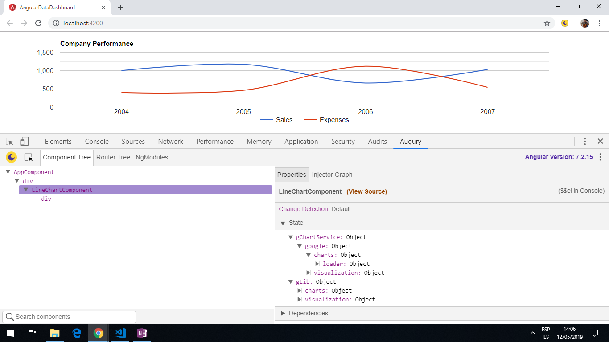

# Angular Data Dashboard

Angular app using [Google Charts](https://developers.google.com/chart/) to create a dashboard with a [line-chart](https://developers.google.com/chart/interactive/docs/gallery/linechart), pie-chart and table-chart.

*** Note: to open web links in a new window use: _ctrl+click on link_**

## Table of contents

* [General info](#general-info)
* [Screenshots](#screenshots)
* [Technologies](#technologies)
* [Setup](#setup)
* [Features](#features)
* [Status](#status)
* [Inspiration](#inspiration)
* [Contact](#contact)

## General info

Google chart tools have a wide range of interactive charts and data tools.

## Screenshots



## Technologies

* [Angular CLI v7.3.9](https://github.com/angular/angular-cli)

* [Angular framework v7.2.15](https://angular.io/)

* [Google Charts](https://developers.google.com/chart/) based on pure html/svg.

## Setup

Run `ng serve` for a dev server. Navigate to `http://localhost:4200/`. The app will automatically reload if you change any of the source files.

Run `ng build` to build the project. The build artifacts will be stored in the `dist/` directory. Use the `--prod` flag for a production build.

Run `ng test` to execute the unit tests via [Karma](https://karma-runner.github.io).

Run `ng e2e` to execute the end-to-end tests via [Protractor](http://www.protractortest.org/).

## Code Examples

```typescript
// method using the Google Charts library using the gLib variable
// create a new chart using the LineChart method, passing in the container div to show the line chart.
private drawChart() {
  const data = this.gLib.visualization.arrayToDataTable([
    ['Year', 'Sales', 'Expenses'],
    ['2004',  1000,      400],
    ['2005',  1170,      460],
    ['2006',  660,       1120],
    ['2007',  1030,      540]
  ]);

  const options = {
    title: 'Company Performance',
    curveType: 'function',
    legend: { position: 'bottom' }
  };

  const chart = new this.gLib.visualization.LineChart(document.getElementById('divLineChart'));

  chart.draw(data, options);
}

```

## Features

* cross-browser compatibility.

* Dashboards can be used to manage multiple charts that share the same data.

## Status & To-Do List

* Status: working app that displays a line chart.

* To-Do: Add other chart types, including gauges...

## Inspiration

* [jscrambler blog by Jay Raj: Creating a Sales Dashboard Using Angular and Google Charts](https://blog.jscrambler.com/creating-a-sales-dashboard-using-angular-and-google-charts/)

* [Google Charts Developers Guide](https://developers.google.com/chart/interactive/docs/gallery/controls)

## Contact

Created by [ABateman](https://www.andrewbateman.org) - feel free to contact me!
